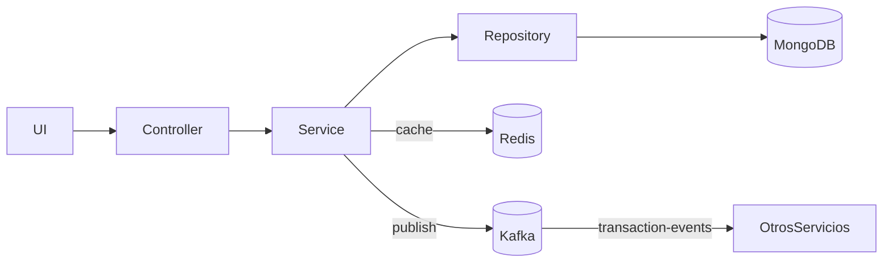

# TransactionMS (Final)

Servicio de **Transacciones** (WebFlux) con **MongoDB Reactive**, **Kafka**, **Redis**, **Docker**, **JaCoCo**, **Checkstyle** y **Swagger**.

## Requisitos
- Java 17, Maven 3.9+
- Docker & Docker Compose

## Ejecutar tests, checkstyle y coverage
```bash
mvn clean verify
# coverage: target/site/jacoco/index.html
# checkstyle: target/checkstyle-result.xml (y consola)
```

## Levantar con Docker
```bash
cd docker
docker compose up -d --build
# Swagger: http://localhost:8081/swagger-ui.html  (o /swagger-ui/index.html)
```

## Endpoints
- `POST /api/v1/transactions`
- `GET /api/v1/transactions/{id}`
- `GET /api/v1/transactions` (opcional `?accountId=`)

## Redis (cache)
- Cache `txById` en `TransactionServiceImpl` (`@Cacheable`).

## Kafka (eventos)
- Topic `transaction-events`. Se publica en `create`.

## Diagrama (Mermaid)

