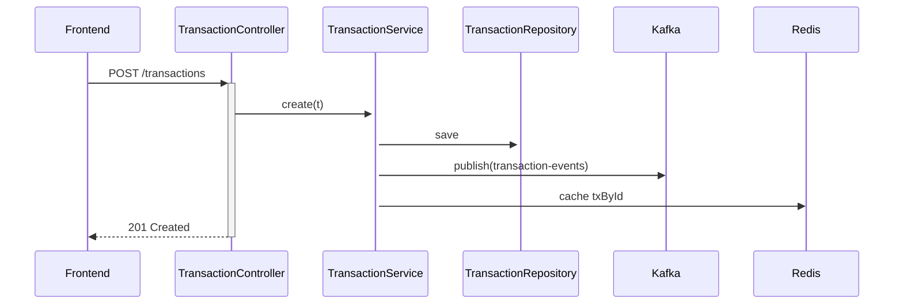

# Diagrams

```mermaid
sequenceDiagram
Frontend->>+TransactionController: POST /transactions
TransactionController->>+TransactionService: create(t)
TransactionService->>+TransactionRepository: save
TransactionService->>Kafka: publish(transaction-events)
TransactionService->>Redis: cache txById
TransactionController-->>-Frontend: 201 Created
```
